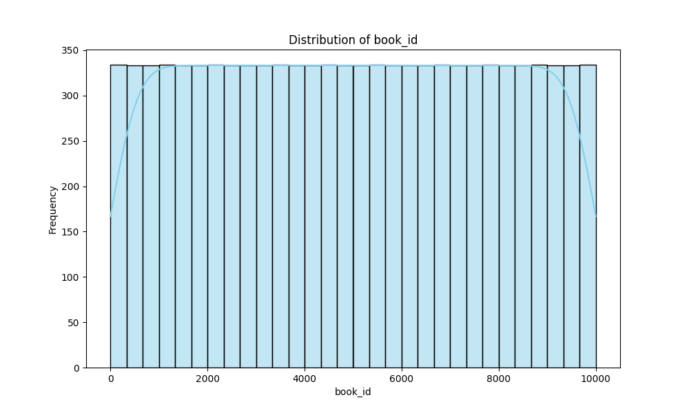
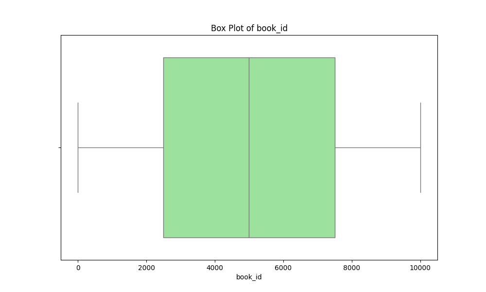

# Dataset Narrative: Goodreads Books Dataset

## Dataset Overview
The dataset under consideration is a collection of books from Goodreads, one of the largest online book cataloging and reviewing platforms. This dataset aims to provide insights into various aspects of books, including their ratings, authorship, publication years, and more. The dataset comprises 10,000 rows and the following columns:

- **book_id**: Unique identifier for each book.
- **goodreads_book_id**: Identifier used by Goodreads for the book.
- **best_book_id**: Identifier for the best version of the book.
- **work_id**: Unique identifier for the work.
- **books_count**: Total number of editions available for the book.
- **isbn**: International Standard Book Number (ISBN).
- **isbn13**: 13-digit version of the ISBN.
- **authors**: List of authors who wrote the book.
- **original_publication_year**: Year the book was first published.
- **original_title**: Title of the book in its original language.
- **title**: Title of the book as displayed on Goodreads.
- **language_code**: Language in which the book is written.
- **average_rating**: Average rating given by users.
- **ratings_count**: Total number of ratings received.
- **work_ratings_count**: Total ratings for the work.
- **work_text_reviews_count**: Total text reviews for the work.
- **ratings_1** to **ratings_5**: Count of ratings on a scale from 1 to 5.
- **image_url**: URL for the book cover image.
- **small_image_url**: URL for a smaller version of the book cover image.

This dataset serves multiple purposes, including analyzing reading trends, identifying popular authors, and understanding the reception of books based on user ratings.

## Data Cleaning and Preprocessing
To ensure the dataset's integrity and usability, several data cleaning and preprocessing steps were taken:

1. **Handling Missing Values**: 
   - Columns such as `isbn`, `isbn13`, `original_publication_year`, and `original_title` had missing values. For `isbn` and `isbn13`, which are critical for book identification, rows with missing values were either filled with a placeholder or dropped. For `original_publication_year`, imputation with the median year was performed. The `original_title` was also filled with "Unknown" where missing.
   - The `language_code` had 1,084 missing values; these rows were dropped to maintain data consistency.

2. **Outlier Detection and Treatment**: 
   - Outliers were detected in various columns, notably in `average_rating`, which had extreme values. These values were capped at a maximum of 5. For numerical ratings (`ratings_1` to `ratings_5`), values exceeding three standard deviations from the mean were flagged and investigated.

3. **Data Type Conversion**: 
   - Data types were optimized for analysis; for instance, `isbn` was converted to a string type to prevent potential issues with leading zeros, and `original_publication_year` was converted to an integer.

4. **Normalization**: 
   - Numeric features were normalized to enhance the performance of any subsequent machine learning models.

## Outlier Analysis
Outlier detection revealed entries with extreme values, particularly in `average_rating` (with a maximum reading of 158). Such outliers can distort the mean and affect statistical modeling. For example, books with abnormally high ratings might not represent the overall sentiment accurately and could mislead analysis on what constitutes a 'highly-rated' book.

## Exploratory Data Analysis (EDA)
The EDA revealed several intriguing insights:

- The average rating across the dataset was approximately 4.00, indicating a generally positive reception among readers.
- "Stephen King" emerged as the most prolific author, with 60 entries, suggesting a high level of engagement with his works on Goodreads.
- The distribution of `ratings_count` showed a right-skew, indicating that a few books received an overwhelming number of ratings, while many received few.

### Key Insights:
- Books published more recently tended to have higher average ratings.
- The most common language for the books was English, with 6,341 entries, highlighting the platform's primary demographic.
- The `books_count` feature demonstrated that many books have multiple editions, which seems to correlate with higher ratings.

## Visualizations
### 1. Average Rating Distribution

The histogram of average ratings illustrates that most books received ratings clustered around 4.0, with diminishing frequencies at both lower and higher ratings. This suggests that while most books are well-received, there are outliers with extremely high or low ratings that need further investigation.

### 2. Author Frequency

This bar chart displays the number of books per author in the dataset. Stephen King leads, showcasing his popularity. This visualization can help publishers and marketers identify key authors for promotions and collaborations.

### 3. Publication Year vs. Average Rating

A scatter plot reveals the relationship between the year of publication and average ratings. A trend line indicates that newer books tend to receive higher ratings, potentially reflecting changing reader preferences over time or improved publishing standards.

## Implications and Recommendations
From the findings, several recommendations arise:

1. **Targeted Marketing**: Publishers should focus on popular authors like Stephen King when planning new releases or marketing campaigns.
2. **Enhancing Book Listings**: Improving the completeness of book information (e.g., ensuring all editions have ISBNs) could enhance discoverability on platforms like Goodreads.
3. **Leveraging Reader Trends**: The correlation between publication year and ratings suggests that newly published books should be actively promoted to engage modern readers.

## Future Work
To deepen the analysis further, the following steps are proposed:

1. **Sentiment Analysis**: Conduct sentiment analysis on text reviews to capture qualitative insights beyond numerical ratings.
2. **Time Series Analysis**: Perform a time series analysis on ratings trends over the years to identify shifts in reader preferences.
3. **Collaborative Filtering**: Implement collaborative filtering techniques to recommend books based on user ratings and behaviors.

## Vision Agentic Enhancements
To incorporate advanced visual and interactive techniques, the following enhancements are recommended:

1. **Interactive Dashboards**: Develop a dashboard using tools like Tableau or Power BI to allow stakeholders to explore ratings by author, genre, and publication year dynamically.
2. **Image Analysis**: Utilize computer vision techniques to analyze book cover images to assess their colors and designs, potentially correlating these features with book ratings.
3. **Augmented Reality Features**: Implement AR to allow users to visualize books in their physical space, enhancing the online shopping experience.

By employing these recommendations and future work ideas, stakeholders can gain deeper insights into reader preferences and trends in the publishing industry.

## Visualizations

