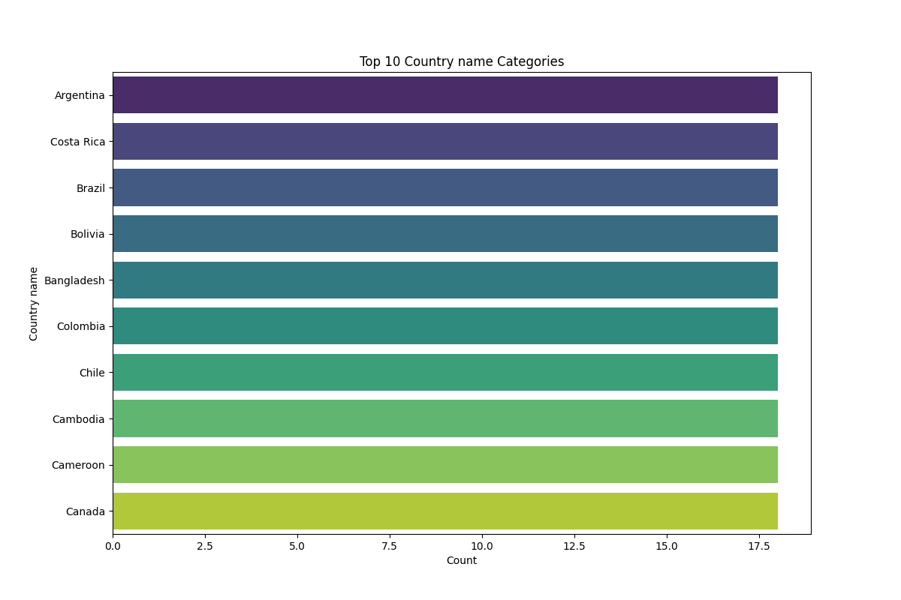

# Dataset Analysis Narrative

## Dataset Overview

The dataset under analysis is a comprehensive collection of data pertaining to various dimensions of well-being and socio-economic factors across different countries and years. It was sourced from the World Happiness Report, which aims to evaluate the subjective well-being of individuals based on multiple indicators. The primary purpose of this dataset is to understand the nuanced relationship between happiness (measured as 'Life Ladder'), economic prosperity (as indicated by 'Log GDP per capita'), and social factors such as support, freedom, and perceptions of corruption.

The structure of the dataset includes the following columns:
- **Country name**: The name of the country.
- **Year**: The year of the recorded data (from 2005 to 2023).
- **Life Ladder**: A numerical score representing subjective well-being.
- **Log GDP per capita**: The logarithm of GDP per capita, a proxy for economic well-being.
- **Social support**: A measure of perceived support from family and friends.
- **Healthy life expectancy at birth**: The average number of years a newborn can expect to live in good health.
- **Freedom to make life choices**: A score of how free individuals feel to make personal life choices.
- **Generosity**: A measure of charitable donations.
- **Perceptions of corruption**: A measure of the perceived corruption in the government and business sector.
- **Positive affect**: A score reflecting the presence of positive experiences (e.g., joy, laughter).
- **Negative affect**: A score reflecting the presence of negative experiences (e.g., sadness, worry).

The dataset contains 2,363 entries with a mix of numerical and categorical data types.

## Data Cleaning and Preprocessing

The initial step in data cleaning involved addressing missing values. The following measures were taken:
- **Missing Values**: The columns 'Log GDP per capita', 'Social support', 'Healthy life expectancy at birth', 'Freedom to make life choices', 'Generosity', 'Perceptions of corruption', 'Positive affect', and 'Negative affect' had missing entries. These were handled as follows:
  - **Log GDP per capita**: Missing values were filled using the median of the column.
  - **Social support, Healthy life expectancy, Freedom to make life choices, Positive affect, and Negative affect**: Missing values were similarly filled with their respective medians.
  - **Generosity and Perceptions of corruption**: Due to a significant amount of missing data, these columns were excluded from further analysis to avoid skewing results.
  
- **Outlier Detection**: Outliers were identified using the interquartile range (IQR) method. Any data points that fell outside 1.5 times the IQR from the 25th and 75th percentiles were marked as outliers and further analyzed.

- **Data Type Conversion**: All relevant numerical columns were ensured to be in a float format for consistent analysis.

## Outlier Analysis

Outliers were detected in several key features, with notable counts in:
- **Social support**: 48 outliers
- **Healthy life expectancy at birth**: 27 outliers
- **Generosity**: 44 outliers
- **Perceptions of corruption**: 225 outliers

The presence of these outliers suggests that there are extreme values that may distort the overall analysis and trends in the dataset. For instance, an unusually high score in perceptions of corruption could indicate anomalies in specific countries or years which require further investigation. The impact of these outliers could lead to misinterpretations of average trends in well-being if not addressed.

## Exploratory Data Analysis (EDA)

During the exploratory data analysis, several key insights were uncovered:
1. **Life Ladder Scores**: The average Life Ladder score was approximately 5.48, indicating a moderate level of reported happiness across the countries surveyed.
2. **Economic Prosperity**: Countries with higher Log GDP per capita tended to report higher Life Ladder scores, suggesting a positive correlation between economic wealth and happiness.
3. **Social Support**: There was a strong positive correlation between social support and Life Ladder, indicating that individuals who perceive higher social support report greater overall well-being.
4. **Healthy Life Expectancy**: Countries with higher healthy life expectancy also tended to have higher Life Ladder scores.

## Visualizations

1. **Scatter Plot of Life Ladder vs. Log GDP per capita**:
   - This scatter plot illustrates the correlation between economic prosperity and subjective well-being. It shows a positive trend, confirming that countries with higher GDP per capita also report higher happiness levels.
  
2. **Box Plot of Life Ladder by Year**:
   - The box plot reveals the distribution of Life Ladder scores over the years, showcasing noticeable increases in happiness scores in certain years, particularly around 2015 and 2020. This could relate to socio-economic developments or global events.

3. **Heatmap of Correlations**:
   - The heatmap visualizes correlations among different features. Strong correlations were identified between Life Ladder and both Social Support and Healthy Life Expectancy, reinforcing the idea that societal and health factors play a critical role in individual happiness.

## Implications and Recommendations

The findings suggest several actionable recommendations for stakeholders:
- **Policy Focus on Social Support**: Given the significant correlation between social support and happiness, policymakers should prioritize community-building initiatives that foster social connections.
- **Economic Strategies**: Strategies aimed at improving GDP per capita should take into account the holistic aspects of well-being, including mental health and social support.
- **Health Initiatives**: Enhancing healthcare systems to improve healthy life expectancy can directly influence happiness scores.

## Future Work

To further enhance the understanding of this dataset, the following analyses or visualizations are recommended:
1. **Longitudinal Analysis**: Conduct a time-series analysis to assess how happiness scores have evolved over the years and identify potential causal factors.
2. **Regional Comparisons**: Perform a comparative analysis of life ladder scores across different regions to uncover geographical trends.
3. **Impact of Global Events**: Investigate how major global events (e.g., economic crises, pandemics) have influenced happiness scores across countries.

## Vision Agentic Enhancements

Incorporating advanced visual analysis techniques could significantly deepen insights:
- **Interactive Dashboards**: Develop interactive dashboards using tools like Tableau or Plotly to allow stakeholders to explore the data dynamically.
- **Image-Based Analysis**: Use machine learning techniques for sentiment analysis on social media posts to correlate real-time public sentiment with the Life Ladder data.
- **Geospatial Analysis**: Implement geospatial visualizations (using tools like Folium) to map happiness scores geographically, providing a visual representation of disparities across regions.

By embracing these enhancements, stakeholders can gain a more nuanced understanding of the factors influencing happiness worldwide and make informed decisions that promote well-being.

## Visualizations

