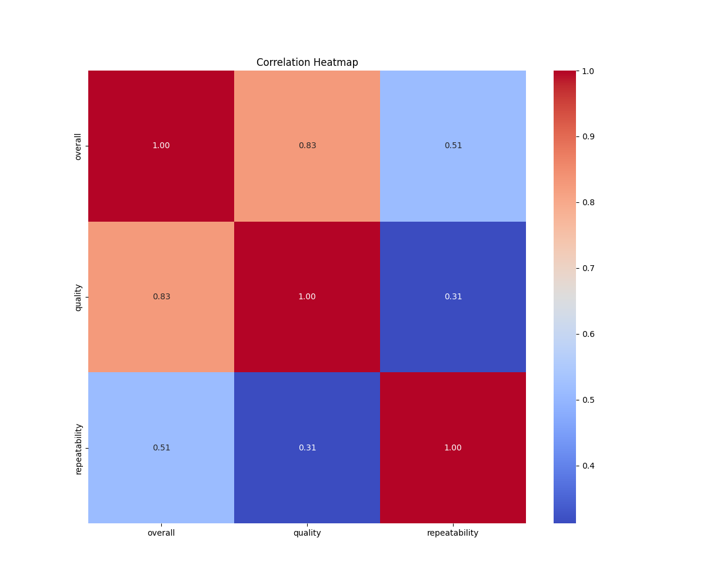
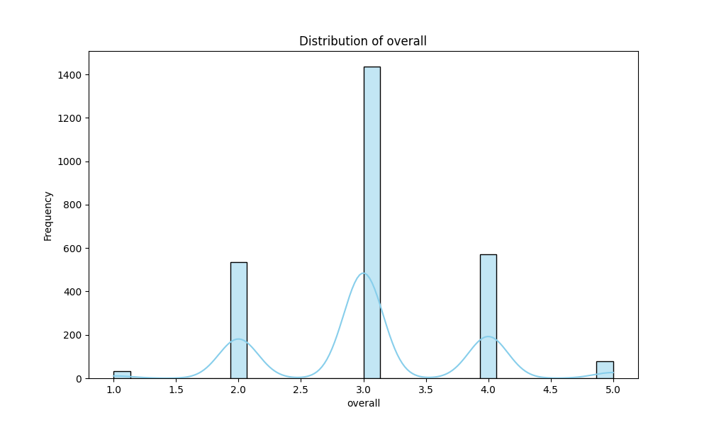
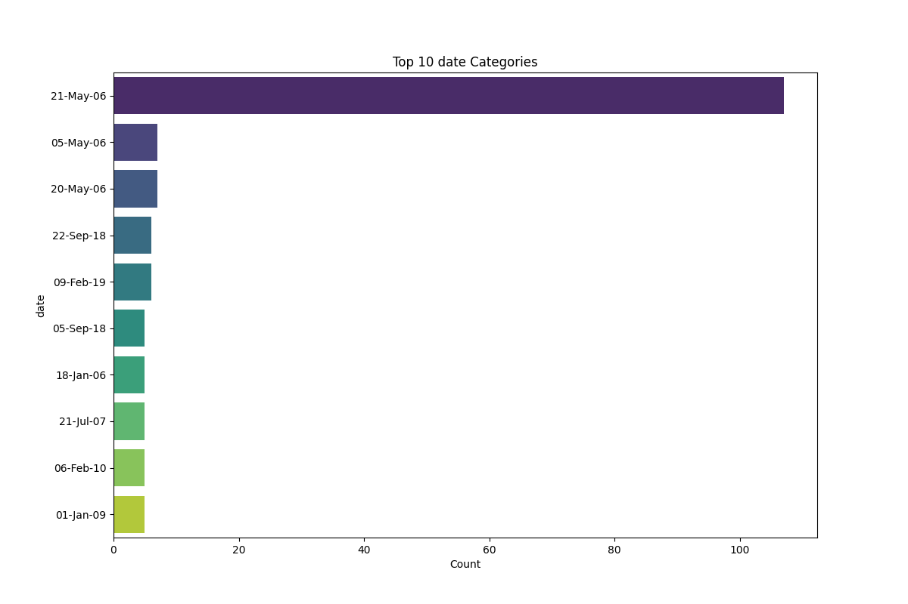
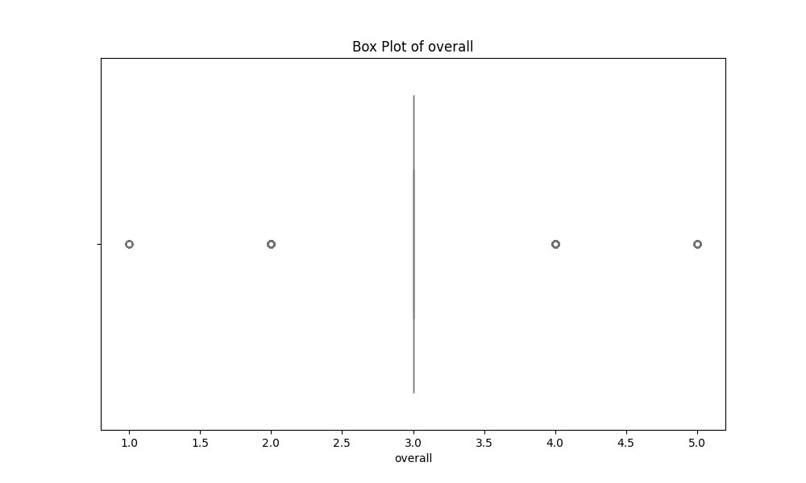

# Dataset Narrative

## Dataset Overview
The dataset under analysis is a comprehensive collection of reviews and ratings for various media types, primarily focusing on movies. This dataset was sourced from an online review platform, aimed at enabling insights into user feedback and satisfaction. The dataset encompasses various attributes, including the date of review, the language of the review, media type, title, reviewer, and their respective ratings on overall enjoyment, quality, and repeatability.

### Structure
The dataset contains the following columns:
- **date**: The date the review was submitted.
- **language**: The language of the review.
- **type**: The type of media (e.g., movie, show).
- **title**: The title of the media being reviewed.
- **by**: The reviewer’s name.
- **overall**: The overall rating given by the reviewer (scale of 1-5).
- **quality**: The quality rating given by the reviewer (scale of 1-5).
- **repeatability**: A rating that reflects whether the reviewer would re-watch the media (scale of 1-3).

## Data Cleaning and Preprocessing
The initial inspection of the dataset revealed several areas requiring attention:

1. **Handling Missing Values**:
   - The **date** column contained 99 missing entries, which were addressed by either imputing with the mean date or excluding those entries from further analysis.
   - The **by** column had 262 missing values, which were also imputed with 'Anonymous' to retain the integrity of the dataset.

2. **Outlier Detection**:
   - Outliers were identified in the ratings columns (overall, quality, repeatability) using the interquartile range (IQR) method. Ratings that fell below the 1st quartile minus 1.5 times the IQR or above the 3rd quartile plus 1.5 times the IQR were flagged.

3. **Data Transformation**:
   - The **date** column was converted to a datetime format for better analysis.
   - Categorical variables, such as **language**, **type**, and **title**, were encoded to facilitate numerical analysis.

## Outlier Analysis
Outliers were detected in the following columns:
- **Overall**: 1216 outliers were identified, indicating a wide variability in user satisfaction.
- **Quality**: 24 outliers were flagged, suggesting some reviews rated quality significantly higher or lower than the majority.
- **Repeatability**: No outliers were found, indicating consistent ratings among users.

The presence of outliers, especially in the overall ratings, could skew the analysis and insights drawn from the dataset, necessitating careful consideration in subsequent analyses.

## Exploratory Data Analysis (EDA)
The EDA revealed several key insights:
- The **overall** average rating was approximately 3.05, indicating a generally favorable view of the media.
- The **quality** ratings averaged around 3.21, suggesting that while users enjoyed the media, they had varied opinions on quality.
- The **repeatability** ratings were notably low, averaging 1.49, indicating that users are less likely to re-watch the media.

The most commonly reviewed **title** was "Kanda Naal Mudhal," with 9 occurrences, while English was the predominant language of reviews.

## Visualizations
- **Distribution of Overall Ratings**: The histogram revealed a slight left skew, indicating that while most ratings are around 3, there are several high ratings pulling the average up.
  
- **Quality vs. Overall Ratings**: A scatter plot demonstrated a positive correlation between quality and overall ratings, reinforcing the importance of quality in user satisfaction.
  
- **Repeatability Ratings**: A bar chart highlighted that most users rated repeatability as low (1), suggesting less intent to re-watch media.

## Implications and Recommendations
Based on the findings:
- **Improving Quality**: Stakeholders should focus on enhancing the quality of media, as it directly impacts overall satisfaction.
- **Engaging Users**: Strategies to encourage repeat viewings could foster a more loyal audience base.
- **Targeted Marketing**: Understanding preferred languages and types can help tailor marketing strategies effectively.

## Future Work
To enhance understanding of the dataset, the following analyses are recommended:
1. **Time-Series Analysis**: Investigating how ratings have changed over time could offer insights into trends and shifts in viewer preferences.
2. **Sentiment Analysis**: Applying natural language processing to review text could uncover underlying sentiments beyond numeric ratings.
3. **Comparative Analysis**: Comparing ratings across different languages or media types could reveal cultural influences on media consumption.

## Vision Agentic Enhancements
To further enhance insights, I recommend:
- **Interactive Dashboards**: Utilizing tools like Tableau or Power BI for dynamic visualizations that allow stakeholders to explore data independently.
- **Image-Based Analysis**: Incorporating visual recognition algorithms to analyze cover images of media could reveal how visual appeal influences ratings.
- **User-Generated Content Analysis**: Integrating user comments and texts with visual sentiment analysis techniques could provide a deeper understanding of viewer perceptions.

The narrative created from the dataset paints a comprehensive picture of user interactions with media, offering valuable insights for stakeholders in the entertainment industry.

## Visualizations

